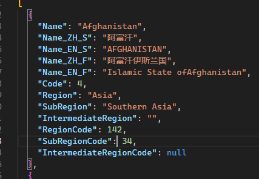

# NnResourceShare

分享资源

## 文件

1. ['ISO-3166' + 'GBT-2659-2000'](ISO-3166+GBT-2659/)  
    'The International Standard for country codes and codes for their subdivisions' + '世界各国和地区名称代码'  
    With this data, you can easily find the Chinese names corresponding to most countries in ISO-3166.  
    通过这个数据，你可以找到 ISO-3166 中大多数国家所对应的中文名称。
    Please note, some of the full English country names in this data are not accurate. It's more suitable for retrieving the corresponding Chinese short names and English short names rather than the full names.  
    这个数据中的国家英文全称中部分数据并不准确，更适合于检索对应的中文简称和国家英文简称而不是全称。  
    

2. [All Gray Image / 灰色图](AllGrayImage/)  
    Covers all possible grayscale pixel arrangement combinations in extremely small-sized images, including data redundancy, such as equivalent rotations and scalings.  
    涵盖了极小尺寸图像中所有可能的灰度像素排列组合，包括冗余数据，如等价的旋转和缩放。  
    ( currently 4x4 imgs only / 目前只有 4x4 尺寸 )
    | 4x4_1081 | 4x4_10002 |
    |:-----:|:-----:|
    |  |  |
